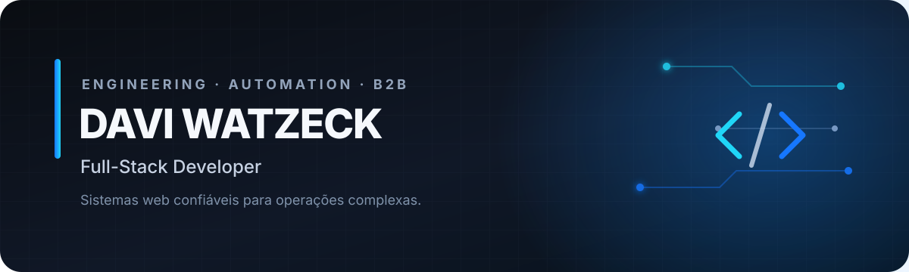

  

  
  
  

  <strong>Transformo processos operacionais complexos em sistemas web confiáveis.</strong> 
  Plataformas B2B, integrações, automações e produtos digitais com foco em operação real.

## Sobre mim

Sou desenvolvedor full-stack com atuação em sistemas web, APIs e automações. Gosto de resolver problemas que exigem rastreabilidade, integração entre serviços e interfaces claras para quem opera o produto todos os dias.

- Desenvolvimento de plataformas B2B do backend ao frontend
- Integrações com APIs, ERPs e rotinas fiscais
- Automação de processos e processamento em lote
- Arquitetura pensada para manutenção, segurança e evolução

## Produtos em destaque

### [NFESis 2.0](https://nfesis.com.br/)

Consulta e processamento de NF-e em lote, integração SERPRO, downloads XML/PDF/ZIP, histórico, relatórios, planos e cobrança.

`Python` `APIs` `NF-e` `Batch processing` `SaaS`

### [RESocial](https://resocial.com.br/)

Infraestrutura de integração eSocial com certificados digitais, assinatura XML, transmissão oficial, protocolos, recibos e dashboard operacional.

`API design` `eSocial` `Certificados digitais` `Governança`

### [Retransmissor](https://retransmissor.com.br/)

Operação eSocial com importação XML/ZIP/RAR, procurações, empregadores, retransmissão, logs e evidências auditáveis.

`Python` `Integrações` `Segurança` `Rastreabilidade`

## Open source

### [WinTools](https://github.com/DaviWatzeck/WinTools)

Caixa de ferramentas para Windows com busca de arquivos em mecanismo Rust nativo, organização de ZIPs e interface desktop. O projeto prioriza execução local, segurança e operações previsíveis.

## Stack principal

**Backend e APIs**

**Frontend**

**Dados e infraestrutura**

## Vamos construir algo confiável?

Estou aberto a conversar sobre sistemas web, integrações, automações e desafios técnicos.

- [Conheça meu portfólio](https://daviwatzeck.github.io/meusite/)
- [Conecte-se comigo no LinkedIn](https://www.linkedin.com/in/davi-watzeck)
- [Envie um e-mail](mailto:davi_watzeck@hotmail.com)

  Engenharia com contexto, código com propósito e atenção à operação real.

